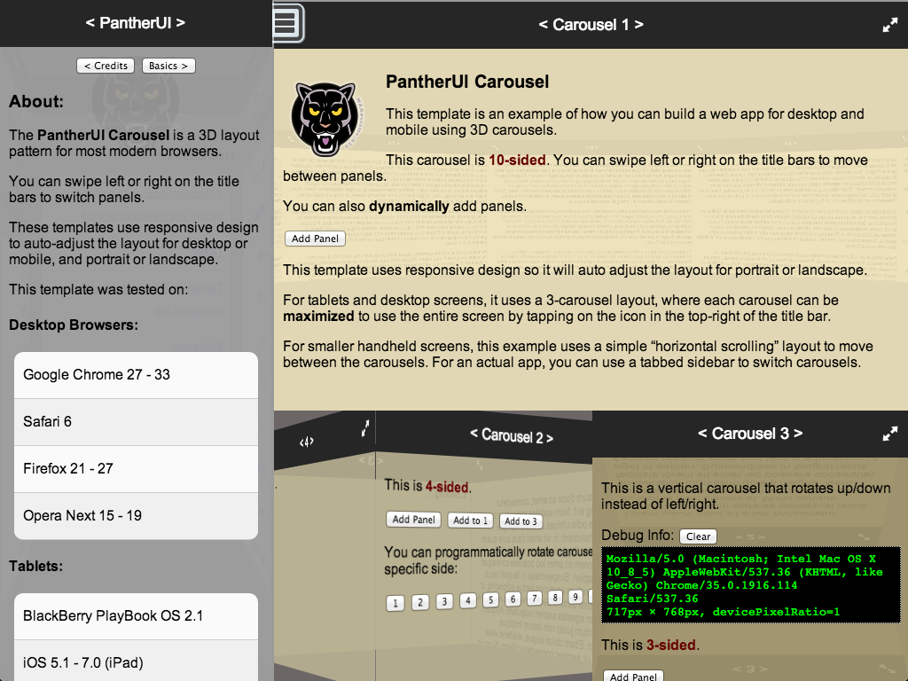
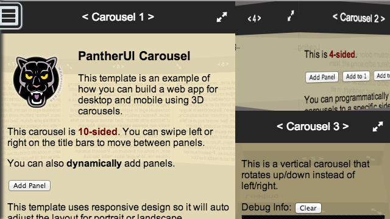
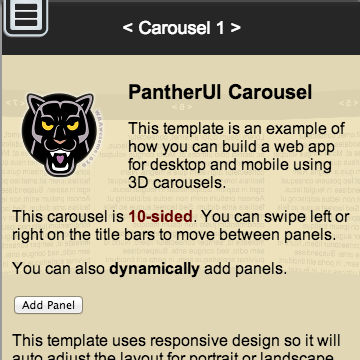

# PantherUI

The PantherUI is a collection of JavaScript modules and templates for creating responsive UIs for desktop and mobile web apps.

## Carousel
The Carousel module lets you easily create multi-sided 3D carousels that you can rotate horizontally or vertically.

### Applies To
- BlackBerry WebWorks

### Author(s)
- Jim Ing

### Dependencies
- None

### Demo
http://psiborg.github.io/PantherUI/

### Screenshots

#### Desktop/Tablet:


#### BlackBerry Z10/Z30 (Landscape):


#### BlackBerry Q5/Q10:


### Usage (see templates/basic1a.html)

1. Include the PantherUI.min.css file, and add your own CSS for the container to set the size and position.

``` css
<link rel="stylesheet" href="dist/PantherUI.min.css">

<style>
#container1 {
    top: 0;
    left: 0;
    width: 100%;
    height: 100%;
}
</style>
```

2. Add the following HTML markup for the container and carousel structure. To create a 4-sided carousel, use 4 figure elements. To add more sides, just add more figure blocks.

``` html
<section class="panther-Carousels">
    <section id="container1" class="panther-Carousel-container">
        <div id="carousel1" class="panther-Carousel-carousel">
            <figure>
                <div class="panther-Carousel-panelTitleBar"><span class="panther-Carousel-panelTitle">&lt; Carousel 1 &gt;</span></div>
                <div class="panther-Carousel-panelContent">
                    <!-- Panel 1: Add your content here -->
                </div>
            </figure>
            <figure>
                <div class="panther-Carousel-panelTitleBar"><span class="panther-Carousel-panelTitle">&lt; 2 &gt;</span></div>
                <div class="panther-Carousel-panelContent">
                    <!-- Panel 2: Add your content here -->
                </div>
            </figure>
            <figure>
                <div class="panther-Carousel-panelTitleBar"><span class="panther-Carousel-panelTitle">&lt; 3 &gt;</span></div>
                <div class="panther-Carousel-panelContent">
                    <!-- Panel 3: Add your content here -->
                </div>
            </figure>
            <figure>
                <div class="panther-Carousel-panelTitleBar"><span class="panther-Carousel-panelTitle">&lt; 4 &gt;</span></div>
                <div class="panther-Carousel-panelContent">
                    <!-- Panel 4: Add your content here -->
                </div>
            </figure>
        </div>
    </section>
</section>
```

3. Include the PantherUI.min.js file, and add your JavaScript to configure and initialize the carousel by element ID.

``` js
<script src="dist/PantherUI.min.js"></script>

<script>
// Initialize carousel
Panther.Carousel.init({
    id: 'carousel1'
});
</script>
```

### How to Build

To build the library yourself, you will need to have [Node.js](http://nodejs.org/) installed.

To install the dependancies (jake, uglify-js, and  clean-css), run the configure script in your shell:

    ./configure

Then run Jake to build the library:

    jake

## Disclaimer
THE SOFTWARE IS PROVIDED "AS IS", WITHOUT WARRANTY OF ANY KIND, EXPRESS OR IMPLIED, INCLUDING BUT NOT LIMITED TO THE WARRANTIES OF MERCHANTABILITY, FITNESS FOR A PARTICULAR PURPOSE AND NONINFRINGEMENT. IN NO EVENT SHALL THE AUTHORS OR COPYRIGHT HOLDERS BE LIABLE FOR ANY CLAIM, DAMAGES OR OTHER LIABILITY, WHETHER IN AN ACTION OF CONTRACT, TORT OR OTHERWISE, ARISING FROM, OUT OF OR IN CONNECTION WITH THE SOFTWARE OR THE USE OR OTHER DEALINGS IN THE SOFTWARE.
